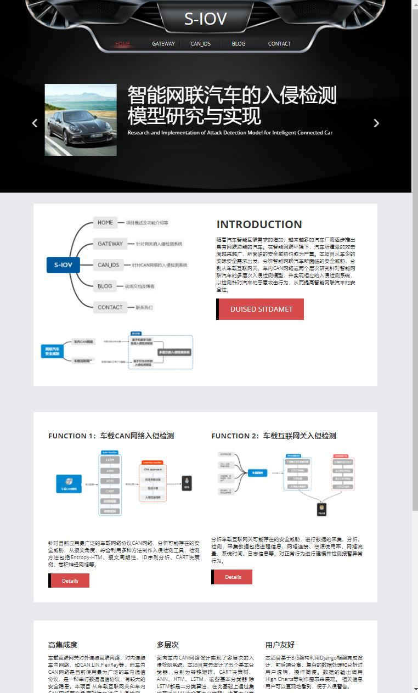
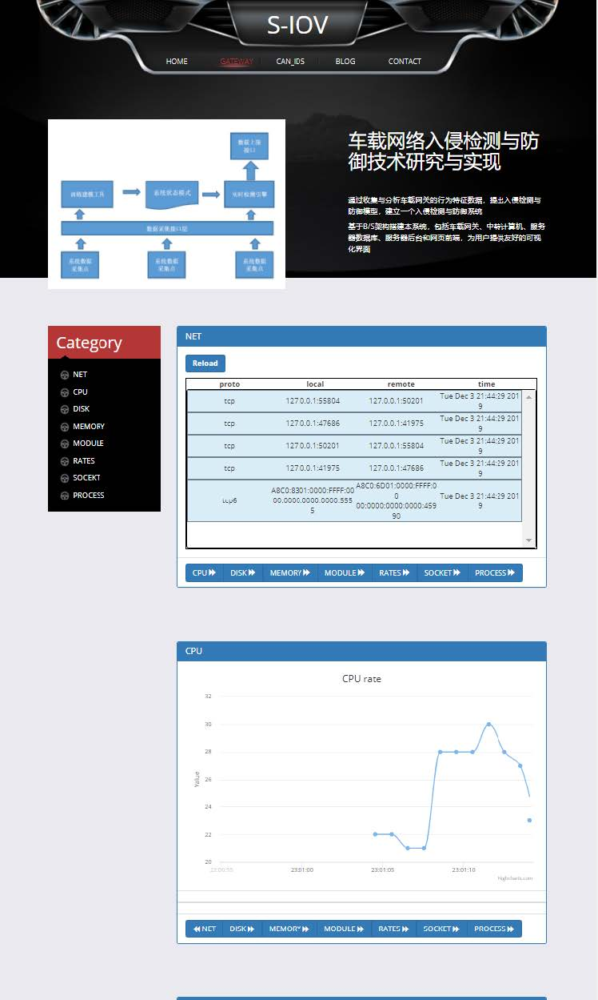

# Gateway-IDS

## 1. 面向车内CAN网络的入侵检测

## siov

基于B/S架构利用Django框架设计实现了入侵检测系统（受服务器性能限制，部分后端算法未集成）

- requirements:
    
    - Django-3.0.7  
    - six-1.15.0
    - keras  
    - tensorflow  
    - sklearn
    - numpy
    - pandas
    - matplotlib
    - nupic
    - tensorflow
    - sklearn

- 在本地8000端口运行(对系统无要求)：
 > python manage.py runserver 127.0.0.1:8000

- 运行截图：

## sourcecode
针对CAN网络的入侵检测模块算法源代码，我们实现了四种入侵检测算法，ANN,LSTM,CART,HTM，转移矩阵。本项目包含了数据的预处理和特征分析的代码以及一些数据示例。

### HTM

基于层级实时记忆(HTM)脑皮质学习算法进行入侵检测。

- requirements:

    nupic

- notice:

    - 代码由nupic例程category_prediction修改过来。
    - 原category本身是一串String列表，而CAN ID也是String，所以替换一下即可。
    - 原例程以预测为目的，修改模型参数后可以获得异常值。
    - 因为仅仅对ID流进行异常检测有其局限性，如果要对数据字段也进行检测的话就涉及对数据字段的SDR编码，idEncoder.py和numEncoder.py分别对id和数据进行编码，简单测试后结果并不理想便未深入。不过此项有解决方案，真的对HTM算法感兴趣的话建议去youtube看视频学习，直接改nupic底层代码中关于SDR编码的部分（耗时耗力）。
    - py文件的结构大致是这样：
        - idEncoder编码CANid
        - numEncoder编码数据字段（未完）
        - mix将idEncoder和numEncoder的结果整合。（实际运用中只涉及idEncoder的结果）
        - webdata相当于main

### LSTM

基于LSTM的多分类器基于python实现，输入是经过预处理的报文特征序列，输出是该序列中的最后一条报文特征的分类结果。可以区分正常，DoS，Fuzzy和Spoofing攻击。

- requirements

    - keras  
    - tensorflow  
    - sklearn
    - numpy
    - pandas
    - matplotlib

- data

    - DoS Attack_dataset.csv
    - Fuzzy Attack_dataset.csv
    - Spoofing the drive gear_dataset.csv

- 运行环境：jupyter lab

- code

    - LSTM_multi.ipynb：我前期的一些尝试性工作
    - LSTM_final.ipynb：最初的完整版本，里面包含了从数据预处理到最终结果的全过程。但此时LSTM时间片长度仍为1，LSTM处理时间序列的优势并没有使用到.
    - LSTM_日期.ipynb：扩展了时间序列，对提取的特征进行了取舍。1127为最终版本。

运行时会保存预处理中间结果到csv文件。保存了训练得到的模型。结果会展示模型参数评估表（precision，recall，F1-score等）和混淆矩阵。

### ANN

本项目也验证了ANN在CAN网络入侵检测这项任务的效果，神经网络分为4层，每个隐层设置了50个神经元。通过加入正则化方法来改进神经网络并调整优化器类型和参数。

该算法基于深度学习框架tensorflow实现

- code

    - pretreatment.py:预处理
    - ann.py:神经网络实现，不带验证集
    - ann_yz.py:神经网络实现，带验证集

### CART

决策树(CART)是一种有监督的学习模型，可以根据特征属性的测度值从训练样本中得到通用的分类模型，并以树形图的方式直观地表示属性和结果之间的逻辑关系。
本算法的实现利用sklearn的集成库实现

## 2. 面向车载互联网关的入侵检测

## gate-web

针对车载互联网关进行信息采集，利用php程序完成网关相关信息的读取并打印到前端界面。数值型数据用high charts图表展示，文本型数据用图表打印出来。

- 运行(以Ubuntu系统为例)

a) 本项目需要利用Apache进行配置，需要安装apache和php  
b) 编辑httpd.conf，使apache支持php  
c) 将项目包放在绝对路径 /var/www/html下  
d) 启动apache服务  
> /etc/init.d/http start  

e) 配置数据库，php代码段中修改代码
>$con = mysqli_connect(ip,database,user_id,password);

e) 访问指定端口实现相关功能，本项目为默认端口
> 127.0.0.1/gateway.html

- 运行截图

## gateway
车载互联网关数据采集源代码。本项目针对的网关运行的系统是ARM架构下的定制化Linux系统，缺少相关依赖库的支持，故本项目用C代码编写相关信息采集程序，并利用交叉编译生成可执行程序，在实际情况中运行效果良好。

使用处在同一局域网内的计算机作为接收端。考虑到数据传输需要满足实时性和高效性，以及车载网关的诸多限制条件，最终采取了socket通信的方式：将socket通信的代码合并到原先的数据采集程序中，将车载网关作为客户端对外传输，计算机作为服务器端接受数据并保存到本地。

